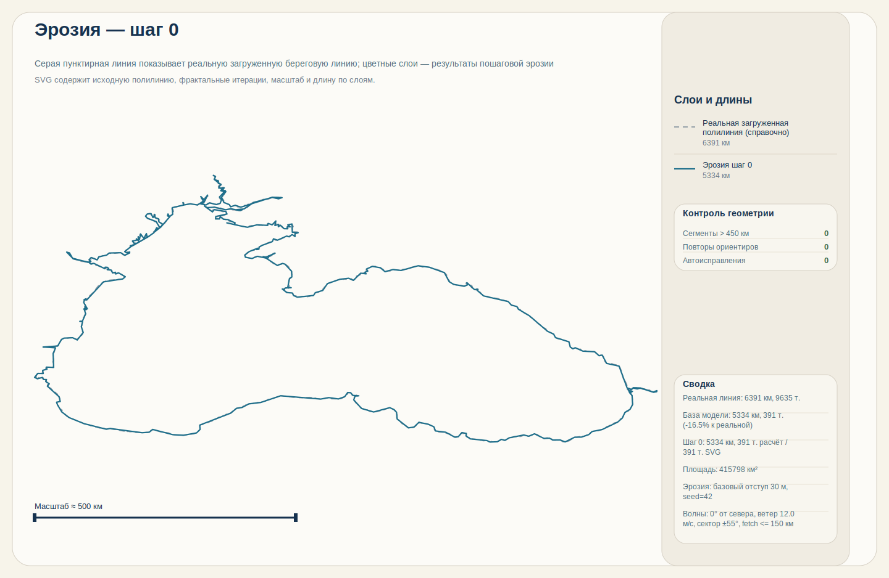
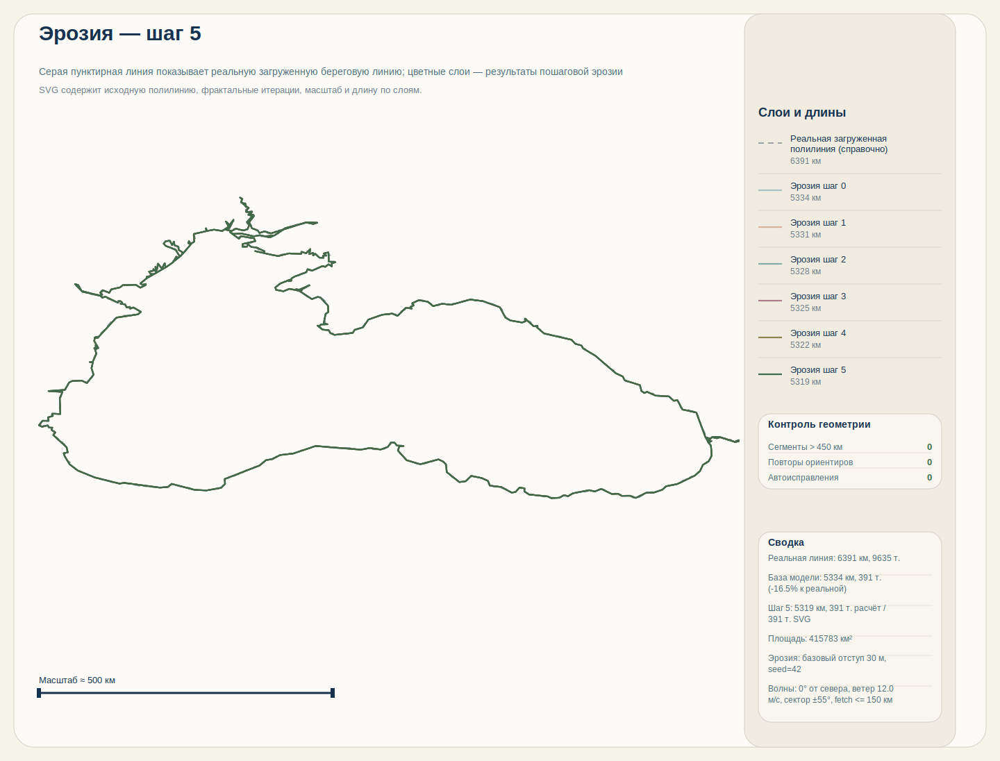

# FRAES — Fractal Approximation of Coastal Geometry

**CLI-проект для проверки геометрии береговой линии, корректного измерения длины и математической демонстрации её фрактальных свойств**

[](https://golang.org/)
[](https://goreportcard.com/report/github.com/Nickitas/Fractal-Approximation-Erosion-Simulation)
[](LICENSE)
[](https://github.com/Nickitas/Fractal-Approximation-Erosion-Simulation/actions)
<!-- [](https://doi.org/...) -->

> Проект разрабатывается в рамках диссертационного исследования  
> **«Построение геометрических образов прибрежных систем»**  
> (на примере Черного моря)

Береговые линии — классический природный фрактал. Сейчас FRAES сфокусирован на трёх проверяемых задачах: валидации геометрии входных данных, корректном геодезическом измерении длины и математически корректной демонстрации фрактальных свойств береговой линии. SVG используется как средство анализа и отчётности.

## Содержание

- [Научная цель](#-научная-цель)
- [Возможности](#-возможности)
- [CLI](#-cli)
- [Установка и запуск](#-установка-и-запуск)
- [Примеры использования](#-примеры-использования)
- [Выходные данные](#-выходные-данные)
- [Демонстрация работы](#-демонстрация-работы)
- [Научные задачи](#-научные-задачи)
- [Области применения](#-области-применения)
- [Цитирование](#-цитирование)
- [Лицензия](#-лицензия)

---

## 🎯 Научная цель

Разработка и верификация комплексной математико-алгоритмической модели геометрического образа береговой линии, сочетающей фрактальные свойства и динамику изменения под воздействием эрозионных процессов.

Практическая цель текущей версии программы:

1. Проверить геометрию входной береговой линии до любых расчётов.
2. Корректно измерить длину береговой линии геодезическими методами.
3. Математически корректно продемонстрировать масштабную зависимость и фрактальные свойства, не подменяя это простым subdivision или декоративной визуализацией.

---

## 🚀 Возможности

- Валидация геометрии береговой линии из JSON-файла
- Геодезический расчёт длины полилинии по географическим координатам
- Демонстрация парадокса береговой линии через изменение масштаба и добавление геометрических деталей
- Классическая и органическая фрактальная аппроксимация береговой линии с управляемым числом итераций
- Стохастическая эрозия (Gaussian случайные сдвиги точек) поверх фрактальных итераций для моделирования динамики
- **Волновая эрозия с физически обоснованной моделью:** направленность волн, fetch-расстояние, экспозиция берега и учёт реальной батиметрии
- **Литологический модуль:** распределение пород по сопротивлению эрозии, IDW-интерполяция, интеграция с волновой эрозией
- **Батиметрический модуль:** загрузка глубин из JSON, билинейная интерполяция, интеграция с волновой эрозией
- **Транспорт наносов:** баланс массы, longshore drift, аккумуляция в бухтах
- **Автоматическая загрузка батиметрии Чёрного моря:** генерирует реальные данные при первом запуске
- Временная симуляция эрозии с несколькими шагами и серией SVG-отчётов; вычисления эрозии распараллелены по чанкам для длинных линий
- Расчёт эмпирической фрактальной размерности методом box-counting с пониженной чувствительностью: усреднение по нескольким сеткам, более плотный набор масштабов и адаптивный выбор устойчивого диапазона регрессии
- **Полный сценарий `all` включает:** валидацию → парадокс → классическая Кох → органическая Кох → фрактальная размерность → волновая эрозия с батиметрией
- Генерация SVG-отчётов для исходной береговой линии и серий `koch_iter_0.svg ... koch_iter_N.svg`, `dimension_iter_0.svg ... dimension_iter_N.svg`, `erosion_step_0.svg ... erosion_step_N.svg`
- Экспорт sidecar `*.metrics.json` с длинами, числом точек, упрощением геометрии и диагностикой фрактальной размерности
- CLI с подкомандами: `source`, `all`, `coastline`, `paradox`, `koch`, `koch-organic`, `dimension`, `erosion`

---

## 🧩 CLI

Подкоманды CLI:

Каноническая структура CLI:

- `fraes real <command>` — прямые расчёты по реально загруженной береговой линии
- `fraes model <command>` — синтетические демонстрации и модельные преобразования, построенные от реальной базовой полилинии
- `fraes source` — проверка источника данных: метаданные набора и сохранение raw snapshot локально
- `fraes all` — смешанный сценарий: сначала реальные метрики, затем модельные этапы

Утилита источника:

- `fraes source` — показывает метаданные текущего набора, сохраняет snapshot сырого payload в `data/snapshots/` или в путь из `--output`

Реальные расчёты:

- `fraes real coastline` — проверяет геометрию входных данных, считает метрики реальной береговой линии и сохраняет `coastline.svg`

Синтетические демонстрации:

- `fraes model paradox` — математически корректно показывает рост длины при уменьшении шага измерения и добавлении деталей; использует реальную линию только как базовую полилинию
- `fraes model koch` — строит классическую кривую Коха поверх базовой полилинии и сохраняет серию `koch_iter_0.svg ... koch_iter_N.svg`
- `fraes model koch-organic` — строит органическую фрактальную аппроксимацию поверх базовой полилинии; дополнительно сохраняет серию `dimension_iter_0.svg ...` с оценкой D и линией теоретического ориентира
- `fraes model dimension` — считает box-counting размерность для синтетических organic-итераций, построенных от базовой полилинии, и сохраняет серию `dimension_iter_0.svg ... dimension_iter_N.svg`; оценка D усредняется по нескольким смещениям сетки и ищет наиболее устойчивое окно масштабов
- `fraes model erosion` — направленная волновая эрозия с учётом fetch, экспозиции и опциональной батиметрии; выводит метрики по шагам и сохраняет серию `erosion_step_0.svg ... erosion_step_N.svg`

Смешанный сценарий:

- `fraes all` — сначала считает реальные метрики загруженной береговой линии, затем запускает синтетические демонстрации

Legacy aliases всё ещё поддерживаются для совместимости: `fraes coastline`, `fraes paradox`, `fraes koch`, `fraes koch-organic`, `fraes dimension`.

Важно: `model paradox`, `model koch`, `model koch-organic`, `model dimension` и синтетические этапы `all` не являются прямым измерением реальной береговой линии после итерации `0`. Они используют загруженный контур только как исходную геометрию модели.

Для производительности проект автоматически упрощает геометрию в двух местах: `coastline.svg` и серии `koch_iter_*.svg` рендерятся по облегчённой копии полилинии, а тяжёлые синтетические команды (`paradox`, `koch`, `koch-organic`, `dimension`, `all`) используют упрощённую базовую геометрию перед рекурсивным ростом. Реальные метрики команды `real coastline` при этом продолжают считаться по полной загруженной линии.

Флаги подкоманд:

- `--input` — путь к локальному JSON/GeoJSON-файлу береговой линии, который используется как fallback
- `--source-url` — удалённый GeoJSON-источник береговой линии; по умолчанию проект сначала пробует официальный Marine Regions WFS для `Black Sea` и только потом уходит в локальный fallback
- `--refresh` — принудительно обновляет локальный кэш удалённого GeoJSON перед расчётом
- `--iterations` — максимальное число итераций Коха
- `--output` — путь к одному SVG, snapshot JSON/GeoJSON или к директории с артефактами
- для `paradox`, `koch`, `koch-organic`, `dimension`, `all`: `--seed` (для стохастики/эрозии), `--angle-jitter`, `--height-jitter`
- для `paradox`, `koch`, `koch-organic`, `dimension`, `all`: `--erosion-strength` — σ гауссовского сдвига точек в метрах; применяется после каждой фрактальной итерации (0 отключает)
- для `erosion`: `--steps`, `--seed`, `--erosion-strength`, `--wave-direction`, `--wind-speed`, `--fetch-spread`, `--fetch-samples`, `--max-fetch-km`, `--depth-scale`, `--exposure-power`, `--bathymetry`, `--lithology`, `--enable-lithology`
- для `paradox`, `koch`, `koch-organic`, `dimension`, `all`: `--model-max-points` (override лимита точек модели) и `--no-model-simplify` (полностью отключить упрощение модели перед фрактальным ростом)

Производительность
- Эрозия вычисляется параллельно: точки разбиваются на чанки (по умолчанию 512) и обрабатываются в горутинах, детерминированные сдвиги задаются seed на каждый индекс, чтобы параллельность не ломала воспроизводимость.

Научная устойчивость
- Box-counting теперь менее чувствителен к положению решётки и произвольному выбору масштабов: для каждой итерации FRAES усредняет покрытие по нескольким смещениям сетки, использует более плотный набор scale factors и выбирает окно регрессии по критериям стабильности, длины окна и качества аппроксимации.
- Это не устраняет методические ограничения box-counting полностью, но уменьшает риск случайно получить "хорошее" значение D из-за удачного положения сетки или слишком узкого диапазона масштабов. Для научной интерпретации это даёт более защищённую и воспроизводимую оценку.

Поведение `--output`:

- если флаг не указан, аналитические и модельные команды сохраняют файлы в `./output/`, а `fraes source` пишет snapshot в `./data/snapshots/`
- если путь заканчивается на `.svg`, это одиночный SVG-файл
- если путь не заканчивается на `.svg`, это директория для результатов
- для команд `koch`, `dimension` и `all` удобнее передавать именно директорию

---

## 🛠 Установка и запуск

```bash
# Клонирование
git clone https://github.com/Nickitas/Fractal-Approximation-Erosion-Simulation.git
cd Fractal-Approximation-Erosion-Simulation

# Сборка
go build -o fraes ./cmd/fraes

# Или через Makefile
make build

# Запуск без сборки
go run ./cmd/fraes --help

# Список команд
./fraes --help

# Посмотреть метаданные источника и сохранить snapshot
./fraes source

# Базовый запуск
./fraes real coastline

# Принудительно обновить GeoJSON-кэш перед запуском
./fraes real coastline --refresh

# Принудительно только локальный fallback
./fraes real coastline --source-url ''
```

### Автоматическая загрузка батиметрии

Проект автоматически загружает реальные батиметрические данные GEBCO для Чёрного моря:

```bash
# Быстрая загрузка через Go
make bathymetry

# Или через Python (если установлен)
make bathymetry-python

# Или напрямую
go run cmd/download-bathymetry/main.go
```

Данные сохраняются в `data/black-sea-bathymetry.json` и автоматически используются при запуске волновой эрозии.

---

## ⚡ Примеры использования

```bash
# 1. Метрики исходной береговой линии + SVG в ./output/
./fraes real coastline

# 0. Метаданные источника и raw snapshot в ./data/snapshots/
./fraes source

# 0a. Принудительно перечитать удалённый источник и сохранить snapshot в свою директорию
./fraes source --refresh --output ./data/snapshots

# 1a. Явно использовать удалённый GeoJSON-источник
./fraes real coastline --source-url 'https://geo.vliz.be/geoserver/MarineRegions/wfs?service=WFS&version=1.0.0&request=GetFeature&typeName=iho&cql_filter=mrgid%3D3319&outputFormat=application%2Fjson'

# 1b. Принудительно перечитать удалённый источник и обновить кэш
./fraes real coastline --refresh

# 2. Синтетическая демонстрация classic Koch от реальной базовой полилинии
./fraes model koch --iterations 4 --output ./output/koch

# 3. Синтетическая organic-модель от той же базовой полилинии
./fraes model koch-organic --iterations 4 --seed 42 --angle-jitter 18 --height-jitter 0.25 --output ./output/organic

# 4. Эмпирическая размерность синтетической organic-модели с усреднением по сеткам
./fraes model dimension --iterations 6 --seed 42 --angle-jitter 18 --height-jitter 0.25 --input data/black-sea.json --output ./output/dim

# 5. Волновая эрозия с батиметрией (физическая модель)
make bathymetry && ./fraes model erosion --steps 10 --erosion-strength 50 --wave-direction 0 --wind-speed 12 --bathymetry data/black-sea-bathymetry.json --output ./output/erosion

# 5a. Волновая эрозия с литологией (учёт сопротивления пород)
# Крым (известняк) эродируется медленнее, дельта Дуная (глинa) — быстрее
./fraes model erosion --steps 10 --erosion-strength 50 --lithology data/black-sea-lithology.json --enable-lithology --output ./output/erosion-lith

# 5b. Полная физическая модель: батиметрия + литология
./fraes model erosion --steps 15 --erosion-strength 50 --wave-direction 45 --wind-speed 14 --bathymetry data/black-sea-bathymetry.json --lithology data/black-sea-lithology.json --enable-lithology --output ./output/erosion-full

# Или через Makefile (автоматическая загрузка если нужно)
make erosion-with-bathymetry

# 6. Волновая эрозия без батиметрии (геометрический proxy)
make erosion

# 7. Полный сценарий с волновой эрозией и батиметрией (всё включено!)
make demo

# Или вручную с параметрами:
./fraes all --iterations 3 --steps 5 --output ./output/full-run
./fraes all --output ./output/full-run
```

## 📊 Выходные данные

После выполнения в каталоге `--output` появятся:

- `coastline.svg` — SVG-отчёт по исходной береговой линии; при validation-warning длинные сегменты подсвечиваются прямо на карте, а в sidebar добавляются блоки `Контроль геометрии` и `Предупреждения`
- `coastline.metrics.json` — длина реальной линии, длина рендер-копии, число точек, эффекты SVG-упрощения, структурированные `validation.summary` / `validation.duplicate_locations` и `highlights.long_segments` для проблемных сегментов
- `koch_iter_0.svg ... koch_iter_N.svg` — SVG-отчёты по синтетическим итерациям classic/organic Koch; поверх них теперь показываются компактные графики роста длины, а справа сводка по типам validation-warning для опорной линии
- `dimension_iter_0.svg ... dimension_iter_N.svg` — SVG-отчёты по synthetic organic-итерациям для команды `dimension`; в них дополнительно показывается график сходимости `D`, построенный по усреднённому box-counting и выбранному устойчивому диапазону масштабов
- `koch.metrics.json`, `koch-organic.metrics.json`, `dimension.metrics.json` — sidecar-метрики по серии: референсная реальная линия, база модели, итерации, длины, теория Коха, box-counting-диагностика и такие же структурированные блоки `validation.summary` / `highlights.long_segments` для опорной линии серии; `validation.summary` теперь всегда содержит стабильные счётчики по типам warning, даже когда они равны `0`
- при большом числе точек SVG экспортирует упрощённую копию геометрии для рендера, но длины и табличные метрики в подписях считаются по расчётной полилинии

Сейчас проект не генерирует `gif` или `csv`-отчёты. Это следующие этапы из плана разработки.

Отдельная команда `fraes source` сохраняет raw snapshot исходного payload в `data/snapshots/` или в путь из `--output`; это независимая копия источника, не совпадающая с рабочим кэшем в `data/cache/`.

По умолчанию загрузка береговой линии работает в режиме `cache-first`: FRAES сначала пытается использовать локальный кэш удалённого GeoJSON в `data/cache/`, затем при необходимости делает HTTP GET к официальному Marine Regions WFS-эндпоинту для `Black Sea` (`mrgid=3319`), обновляет кэш и только при сетевой или форматной ошибке использует локальный `data/black-sea.json`. Флаг `--refresh` принудительно пропускает чтение из кэша и заново скачивает удалённый источник.

---

## 🎬 Демонстрация работы

Полный визуальный прогон программы — от исходной береговой линии до фрактальных итераций и анализа размерности.

### 1. Исходная береговая линия Черного моря

Команда: `./fraes real coastline`

Результат — валидация геометрии и расчёт базовых метрик:


**Метрики:**
- Длина береговой линии рассчитана геодезическими методами
- Файл `coastline.metrics.json` содержит детальные данные о длине, числе точек и результатах валидации

---

### 2. Классическая фрактальная аппроксимация (Koch)

Команда: `./fraes model koch --iterations 5 --output ./output/full-run`

Серия SVG показывает рост детализации с каждой итерацией:

**Итерация 0** — базовая полилиния:


**Итерация 1:**


**Итерация 2:**


**Итерация 3:**


**Итерация 4:**


**Итерация 5:**


**Наблюдение:** С каждой итерацией длина береговой линии растёт — демонстрация парадокса береговой линии.

---

### 3. Органическая фрактальная аппроксимация

Команда: `./fraes model koch-organic --iterations 5 --seed 42 --output ./output/organic`

Органическая версия добавляет стохастические сдвиги для более естественного вида:

**Итерация 0:**


**Итерация 2:**


**Итерация 4:**


**Итерация 5:**


**Наблюдение:** Органическая модель создаёт более природные формы благодаря Gaussian-сдвигам точек.

---

### 4. Анализ фрактальной размерности (Box-Counting)

Команда: `./fraes model dimension --iterations 6 --output ./output/dim`

Серия графиков показывает сходимость оценки фрактальной размерности D:

**Итерация 0:**


**Итерация 2:**


**Итерация 4:**


**Итерация 5:**


**Наблюдение:** С каждой итерацией оценка D приближается к теоретическому значению Коха (~1.2619).

---

### 5. Волновая эрозия с батиметрией (входит в `all`)

Команда: `./fraes all --iterations 3 --steps 5 --output ./output/full-run`

Физическая модель учитывает направление волн, расстояние fetch и реальные глубины у берега. **Автоматически включается в команду `all`!**

**Шаг 0** — исходная береговая линия:



**Шаг 5** — финальное состояние:



**Наблюдение:** Открытые мысы (высокая экспозиция, большой fetch) размываются сильнее, чем защищённые бухты. Батиметрия усиливает этот эффект — глубоководные участки получают больше волновой энергии.

---

### 5a. Волновая эрозия с литологией

Команда: `./fraes model erosion --steps 10 --lithology data/black-sea-lithology.json --enable-lithology`

Литологический модуль добавляет дифференцированную эрозию по типу породы:

**Распределение пород (Чёрное море):**

| Порода | Сопротивление | Цвет | Примеры регионов |
|--------|---------------|------|------------------|
| Серпентинит | 9.0 | #2d2d2d | Турция (Pontic) |
| Вулканит | 6.5-7.0 | #4a4a4a | Турция, Грузия |
| Известняк | 4.0-4.8 | #6b6b6b | Крым, Болгария |
| Песчаник | 2.8 | #8b8b8b | Крым (восток) |
| Глина | 1.0-1.5 | #c4a484 | Румыния, Крым (запад) |
| Дельта | 0.8-1.0 | #d4a484 | Дельта Дуная |

**Физический принцип:**
```
retreatActual = retreatBase / Resistance

Известняк (R=4.5):  retreat / 4.5  → медленная эрозия
Глина (R=1.2):      retreat / 1.2  → быстрая эрозия
Дельта (R=0.9):     retreat / 0.9  → очень быстрая эрозия
```

**Наблюдение:** Дельта Дуная (ил, R≈1) размывается в ~5 раз быстрее известняков Крыма (R≈4.5) при одинаковых волновых параметрах.

---

### 6. Полный сценарий `all` (рекомендуется)

Команда: `make demo` или `./fraes all --iterations 3 --steps 5`

Запускает **все этапы** автоматически:

1. ✅ Валидация береговой линии
2. ✅ Парадокс береговой линии
3. ✅ Классическая фрактальная аппроксимация (Koch)
4. ✅ Органическая фрактальная модель
5. ✅ Анализ фрактальной размерности
6. ✅ **Волновая эрозия с батиметрией** (новое!)

**Выходные файлы:**
- `coastline.svg` — исходная береговая линия
- `koch_iter_*.svg` — классическая Кох
- `koch-organic_iter_*.svg` — органическая модель
- `dimension-organic_iter_*.svg` — анализ размерности
- `erosion_step_*.svg` — волновая эрозия (новое!)

---

## 🧪 Научные задачи проекта

1. Сравнительный анализ различных уровней представления береговой линии
2. Исследование фрактальных свойств природных и синтетических кривых
3. Разработка и калибровка физически обоснованной модели волновой эрозии с учётом батиметрии
4. Верификация модели на реальных данных Черного моря
5. Создание открытого инструментария для автоматизированного анализа прибрежных систем

---

## 🌍 Области применения

- Геоморфология и динамика береговых зон
- Фрактальная геометрия и вычислительная геометрия
- Экологическое прогнозирование и оценка рисков эрозии
- Образовательные курсы по фракталам и моделированию природных процессов

--- 

## 📄 Лицензия

Проект распространяется под лицензией **MIT** — см. файл [LICENSE](LICENSE).

---
