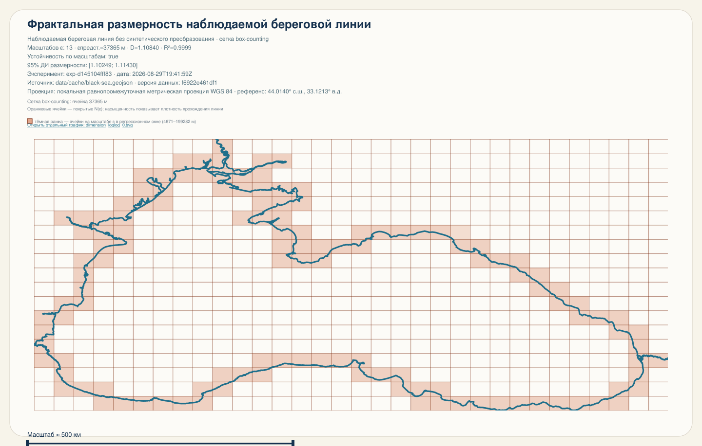
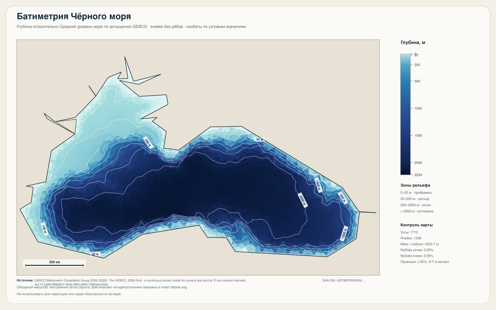
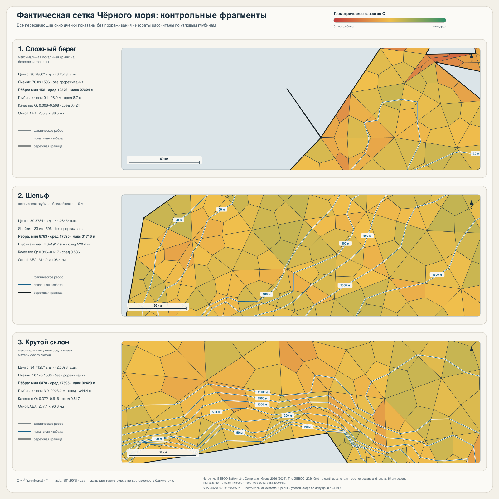

# Lito — береговая линия и рельеф дна Чёрного моря

[](go.mod)
[](LICENSE)

Lito — программа командной строки для воспроизводимого исследования Чёрного моря. Она анализирует береговую линию, строит и сравнивает четырёхугольные сетки, назначает им глубины, визуализирует рельеф дна и моделирует вдольбереговой перенос наносов.

Программа предназначена только для Чёрного моря. Результаты, параметры и отчёты каждого расчёта сохраняются в `output/`.

## Возможности

- проверка источника, снимок и карта береговой линии;
- фрактальный анализ наблюдаемого контура;
- генерация и ранжирование четырёхугольных сеток;
- экспорт модели дна в MSH, VTU, CSV и JSON;
- карты глубин, изобаты, фрагменты сетки, трёхмерный рельеф и профили;
- адаптивные сетки и сравнение генераторов Gmsh;
- проверка качества рельефа и полного контура;
- модель переноса наносов CERC и калибровка по наблюдениям.

## Галерея

<p align="center">
  
  
</p>
<p align="center">
  
</p>

*Слева — контур с покрывающими ячейками, справа — батиметрическая карта, ниже — увеличенные фрагменты фактической сетки.*

## Установка и быстрый старт

Нужны Go 1.25.4 или новее. Для генерации сеток также нужен [Gmsh](https://gmsh.info/). Для модели дна требуются подготовленные данные GEBCO и четырёхугольная MSH; для модели эрозии — батиметрия и временной ряд волн.

```bash
git clone https://github.com/Nickitas/litora-cli
cd lito-cli
go build -o lito ./cmd/lito

./lito --help
./lito source
./lito map black-sea
./lito dimension --full-black-sea
```

В Windows запускайте `lito.exe`. Вместо сборки допустим вариант `go run ./cmd/lito <команда>`.

Для точной справки используйте:

```bash
./lito <команда> --help
./lito seabed <подкоманда> --help
```

Глобальный флаг `--quiet` отключает обычный текстовый вывод. У расчётных команд `--output <каталог>` меняет корень результатов, по умолчанию это `./output`.

## Все команды

```text
lito
├── source          источник и снимок береговой линии
├── map             карта полного побережья
├── dimension       фрактальный анализ наблюдаемого контура
├── mesh            сравнение генераторов 2D-сетки
├── seabed          модель рельефа дна и адаптивные сетки
├── erosion         модель переноса наносов CERC
├── calibrate-cerc  физическая калибровка CERC
├── all             пакетный эксперимент
└── completion      автодополнение оболочки
```

## Береговая линия

### Источник: `source`

Проверяет источник, метаданные и геометрию контура; может обновить кэш или сохранить снимок.

```bash
./lito source
./lito source --refresh
./lito source --input data/black-sea.geojson
./lito source --output output/source
```

Главные флаги: `--input`, `--source-url`, `--refresh`, `--output`.

### Карта: `map black-sea`

Создаёт SVG-карту полного моря и GeoJSON-экспорт.

```bash
./lito map black-sea
./lito map black-sea --refresh
./lito map black-sea --input data/black-sea.geojson --output output/my-map
```

Обычный путь SVG: `output/black-sea-map/svg/black-sea-coast.svg`.

### Масштабный анализ: `dimension`

Оценивает фрактальную размерность неизменённой наблюдаемой линии методом подсчёта покрывающих ячеек. Результат зависит от разрешения входного контура и диапазона масштабов.

```bash
./lito dimension --full-black-sea
./lito dimension --input data/local-coast.geojson
./lito dimension --full-black-sea --refresh
```

Результаты: `output/dimension/` — SVG, логарифмический график, таблицы и метрики.

## Расчётные 2D-сетки: `mesh`

Команда сравнивает Делоне, фронтальный алгоритм для четырёхугольников и упаковку параллелограммов. Рейтинг учитывает сохранение площадей кос, заливов и островов, отклонение границы, долю четырёхугольников и качество ячеек.

```bash
# Сравнение двух уровней детализации
./lito mesh \
  --gmsh gmsh \
  --boundary-details "1000,500" \
  --cell-sizes "1000,500" \
  --generator-timeout 10m

# Один уровень и два алгоритма
./lito mesh \
  --gmsh /usr/local/bin/gmsh \
  --boundary-details "500" \
  --cell-sizes "500" \
  --generators "delaunay,frontal-quad"
```

| Флаг | Назначение |
|---|---|
| `--boundary-details` | допуски детализации берега, м |
| `--cell-sizes` | целевые длины рёбер, м |
| `--generators` | `delaunay`, `frontal-quad`, `parallelograms` |
| `--generator-timeout` | ограничение времени одного запуска |
| `--max-cells`, `--allow-large` | защита от чрезмерного расчёта |
| `--input`, `--refresh`, `--source-url` | управление контуром |

Результаты: `output/mesh/` — MSH, SVG, таблицы и `mesh-comparison.json`.

> Для всей акватории метод Делоне показал лучший итоговый результат. Уровень 500–1000 м предпочтителен для сохранения площадей береговых форм, а 200–1000 м — когда важнее точность глубин. Подробнее: [сравнение генераторов](docs/adaptive-generator-comparison.md).

## Модель дна: `seabed`

`seabed` создаёт новый формат `lito-seabed/v1`, не изменяя входной MSH. Перед первой сборкой нужны полная четырёхугольная MSH, подтверждённый производный JSON-набор GEBCO с паспортом и, при необходимости, GeoJSON полного контура. См. [источник батиметрии](docs/bathymetry-source-selection.md) и [контракт данных](docs/adr/seabed-data-contract.md).

### Основной маршрут

```bash
# 1. Назначить глубины и экспортировать MSH, VTU, CSV, JSON
./lito seabed build \
  --mesh output/mesh/msh/black-sea-edge-1000-detail-1000-frontal-quad.msh \
  --bathymetry output/export-01-verification/gebco2026-0.02deg.json

# 2. Карта глубин, изобаты, 3D-рельеф и профили
./lito seabed render

# 3. Поле требуемых размеров
./lito seabed adapt

# 4. Одна адаптивная сетка
./lito seabed generate-adaptive --gmsh gmsh --generator delaunay

# 5. Сравнение генераторов на общем поле
./lito seabed compare-adaptive --gmsh gmsh
```

| Подкоманда | Когда запускать | Главные результаты |
|---|---|---|
| `build` | есть плоская MSH и GEBCO | MSH, VTU, CSV, JSON, паспорт |
| `render` | глубины назначены | карта, изобаты, фрагменты, 3D-рельеф, профили |
| `adapt` | перед адаптивной генерацией | поле размера: CSV, JSON, SVG |
| `generate-adaptive` | нужна одна сетка выбранным методом | MSH, отчёт и топологическая проверка |
| `compare-adaptive` | нужен обоснованный выбор метода | рейтинг, метрики, SVG и таблицы |
| `validate` | есть независимая опорная модель | ошибки глубин, изобат, уклона и размера |
| `check-full` | проверка полного контура 1000 м | полный отчёт, экспорты и визуализации |
| `expert-set` | подготовка экспертных карточек | фрагменты и шаблон оценок |
| `assess-ml` | эксперты заполнили оценки | вывод, нужна ли обучаемая модель |

### Полезные варианты

```bash
# Подробная полоса у берега
./lito seabed adapt \
  --min-size 200 --coast-size 300 --shelf-size 500 --deep-size 1000

# Фронтальный генератор с лимитом ресурсов
./lito seabed generate-adaptive \
  --gmsh gmsh --generator frontal-quad --max-cells 5000000

# Два уровня детализации
./lito seabed compare-adaptive \
  --gmsh gmsh \
  --levels "detailed:200:1000,coarse:500:1000"

# Другой масштаб вертикального преувеличения
./lito seabed render --vertical-exaggeration 25

# Независимая проверка
./lito seabed validate \
  --reference data/reference-depth.msh \
  --reference-passport data/reference-depth.passport.json

# Проверка полного моря
./lito seabed check-full --generator frontal-quad --target-edge 1000
```

Документы: [CLI модели дна](docs/seabed-cli.md), [3D-рельеф и профили](docs/bathymetry-3d-profiles.md), [проверка качества](docs/relief-quality-validation.md), [адаптивные сетки](docs/adaptive-gmsh.md).

## Эрозия и перенос наносов

### `erosion` — модель CERC

Без аргументов используется открытый демонстрационный набор Сочи. Он подходит для знакомства, но не для вывода о годовом размыве и не для калибровки.

```bash
# Демонстрационный расчёт
./lito erosion --black-sea-sochi --steps 4

# Расчёт по фактическим данным
./lito erosion \
  --input data/coast-segment.geojson \
  --bathymetry data/bathymetry.json \
  --bathymetry-resolution 0.02 \
  --wave-input data/waves.csv \
  --wave-source "источник и период наблюдений"
```

Полезные параметры: `--cerc-coefficient`, `--closure-depth`, `--berm-height`, `--porosity`, `--structures`, `--sediment-sources`, `--left-boundary-transport`, `--right-boundary-transport`, `--output-csv`, `--output-gif`.

Результаты: `output/erosion/` — SVG-состояния, метрики, CSV и при запросе GIF. Ограничения модели: [руководство CERC](docs/cerc-one-line-model.md).

### `calibrate-cerc` — физическая калибровка

Нужны локальный контур, батиметрия с фактическим шагом, волновой ряд репрезентативной длительности и независимые наблюдения годовых скоростей.

```bash
./lito calibrate-cerc \
  --input data/coast-segment.geojson \
  --bathymetry data/bathymetry.json \
  --bathymetry-resolution 0.02 \
  --wave-input data/waves-year.csv \
  --observations data/observed-rates.json \
  --cerc-coefficients "0.2,0.3,0.39,0.5,0.6"
```

Не используйте короткий прогноз волн для калибровки.

## Контрольные и служебные команды

### `all` и `completion`

`all` повторяет согласованный пакет этапов при уже подготовленных данных:

```bash
./lito all
./lito all --refresh
./lito all --help
```

Автодополнение оболочки:

```bash
# В текущем сеансе zsh
source <(./lito completion zsh)

# Постоянно для zsh
./lito completion zsh > "${fpath[1]}/_lito"

# Другие оболочки
./lito completion bash
./lito completion fish
./lito completion powershell
```

## Каталоги результатов

| Задача | Каталог | Содержимое |
|---|---|---|
| Карта и контур | `output/black-sea-map/` | SVG, GeoJSON, журнал |
| Фрактальный анализ | `output/dimension/` | графики, метрики, таблицы |
| Сетки | `output/mesh/` | MSH, SVG, отчёт сравнения |
| Рельеф дна | `output/seabed/` | MSH, VTU, CSV, JSON, SVG, отчёты качества |
| Эрозия | `output/erosion/` | состояния, метрики, CSV, GIF |
| Материалы статьи | `output/article_1/` | отчёты и рисунки публикации |

Не удаляйте файлы `metadata`, `passport` и `report`: в них зафиксированы источник данных, параметры и контрольные суммы.

## Воспроизводимость и документация

- Используйте только контуры Чёрного моря.
- Для публикационного вывода сохраняйте снимок источника, исходные наборы, версию Gmsh и JSON-отчёты.
- Уровень 500–1000 м лучше сохраняет площади существенных форм всей акватории, но локальные участки требуют отдельной проверки.
- Проверка `seabed validate` независима лишь при отдельной опорной модели и отдельном паспорте происхождения.

Дополнительные материалы: [источник береговой линии](docs/coastline-source-selection.md), [построение сеток](docs/mesh-generation.md), [сравнение генераторов](docs/adaptive-generator-comparison.md), [экспорт модели дна](docs/seabed-msh-export.md), [контроль полного моря](docs/full-black-sea-quality.md).

## Лицензия

Проект распространяется по лицензии [MIT](LICENSE).
