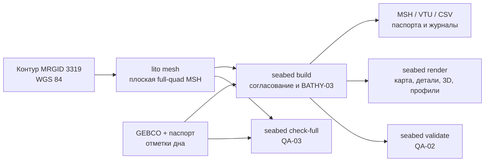

# Научное и пользовательское руководство по модели дна Чёрного моря

## Назначение результата

Lito строит проверяемую геометрию дна на фактической четырёхугольной сетке:
каждому узлу и ячейке назначаются отметка, глубина и производные
характеристики. Результат предназначен для анализа береговой линии, формы дна,
изобат, уклонов и подготовки входов последующих численных экспериментов.

Он не является навигационной картой, набором новых измерений или готовой
2D-гидродинамической моделью. Уменьшение ребра до 200–300 м улучшает описание
береговой геометрии, но не создаёт новые промеры дна между узлами GEBCO.



## Данные, координаты и знак

| Слой | Роль | Что следует помнить |
|---|---|---|
| MarineRegions MRGID 3319 | внешний берег и островные отверстия | это граница акватории, а не прямоугольник загрузки растра |
| GEBCO_2026 Grid + TID | основной источник отметок и происхождения | исходная сетка имеет шаг 15″; TID обязателен для оценки происхождения значений |
| EMODnet DTM 2024 | контроль побережья и шельфа | межпродуктовое сравнение не считается независимой полевой валидацией |
| LAEA | метрическая плоскость сетки | `X/Y` и длины рёбер заданы в метрах; WGS 84 узлов хранится отдельно |

Каноническая величина — `elevation_m`: под водой она отрицательна и
направлена вверх. Положительная глубина выводится, а не вводится вручную:

```text
water_depth_m = max(0, -elevation_m)
```

Берег и острова получают явное условие `elevation_m = 0` и
`water_depth_m = 0`. Пропуск источника остаётся `null`; нулём его заменять
нельзя. Полный контракт полей, единиц и NoData дан в
[`adr/seabed-data-contract.md`](adr/seabed-data-contract.md).

GEBCO использует отметки в метрах с допущением среднего уровня моря, но для
отдельных мелководных исходников возможна другая вертикальная система. Lito
не выполняет скрытое вертикальное преобразование: название системы, оговорка
и EPSG, если он известен, переносятся из паспорта в MSH, VTU и CSV. EMODnet в
варианте LAT нельзя сравнивать с GEBCO/MSL без документированного
преобразования. Источник, лицензии и ограничения описаны в
[`bathymetry-source-selection.md`](bathymetry-source-selection.md).

## Как назначается глубина

Для внутреннего узла регулярного набора GEBCO сохраняется один из трёх
способов назначения:

1. `exact` — координаты совпали с точкой источника.
2. `bilinear` — отметка получена по четырём соседним точкам.
3. `nearest` — в ячейке источника есть пропуск, поэтому выбрана ближайшая
   реальная точка в заданном радиусе.

Для `bilinear` и `nearest` записывается `source_distance_m`. За пределом
`--max-source-distance` ближайшая замена запрещена и результат остаётся
NoData. Береговой ноль не прячет исходную отметку: исходное и
скорректированное значения фиксируются в `reconciliation-corrections.csv`.

В прибрежной переходной полосе отрицательная отметка сглаживается к нулю
функцией smoothstep. Коррекция не может искусственно углубить дно; это
контролирует `deepened_node_count = 0`. Формулы и диагностические поля даны в
[`bathymetry-coastline-reconciliation.md`](bathymetry-coastline-reconciliation.md),
а числовые тесты — в
[`bathymetry-interpolation-quality.md`](bathymetry-interpolation-quality.md).

## Как читать результаты

| Артефакт | Что показывает | Чего по нему нельзя заключать |
|---|---|---|
| `bathymetry-overview.svg` | глубинные зоны, изобаты, берег, острова и NoData | внутренние рёбра не показаны; мозаичность не означает волны или отдельные объекты дна |
| `mesh-details.svg` | три непрореженных фрагмента фактической сетки и качество формы ячеек | цвет качества формы не является точностью глубины |
| `seabed-3d.svg` | ортографический рельеф по узловым отметкам | вертикальное преувеличение влияет только на вид; SVG не является 3D-решателем |
| `profiles.svg`, `profiles.csv` | трассы «берег → глубоководное ядро» по рёбрам MSH | трасса не обязана быть нормалью к берегу |
| `build-report.json` | версии, SHA-256, покрытие, ресурсы и статус модели | `accepted` не равен независимой научной валидации |
| `full-quality.json` | топология, площадь, объём и предупреждения QA-03 | локальные предупреждения источника нельзя скрывать усреднением |

Подробная расшифровка находится в
[`bathymetry-overview-map.md`](bathymetry-overview-map.md),
[`bathymetry-mesh-details.md`](bathymetry-mesh-details.md) и
[`bathymetry-3d-profiles.md`](bathymetry-3d-profiles.md).

## Научная проверка качества

`QA-01` проверяет численную интерполяцию и NoData на аналитических
поверхностях. `QA-02` сравнивает модель с отдельной опорной поверхностью по
глубине, объёму, зонам, изобатам и уклонам. `QA-03` запускает полный контур
1000 м и проверяет связность, границы, знак, площадь, объём и ресурсы.

`accepted` означает прохождение системных критериев. `publication_ready`
дополнительно требует QA-02 класса `independent_measurements`: рейсовых
промеров или другого независимого набора. Сравнение GEBCO и EMODnet такого
статуса не даёт. Методика находится в
[`relief-quality-validation.md`](relief-quality-validation.md) и
[`full-black-sea-quality.md`](full-black-sea-quality.md).

## Граница с гидродинамикой и эрозией

Текущая full-quad сетка — геометрический каркас и дискретизированная
батиметрическая поверхность. В ней нет уравнений мелкой воды, расходов,
течений, уровней, граничных условий, переноса наносов во времени или решения
волнового поля.

`lito erosion` использует отдельную локальную одномерную one-line модель
CERC. Она не принимает полную Gmsh-сетку как 2D-решатель и не должна
называться 2D-гидродинамической моделью. Для будущей 2D-морфодинамической
ветви потребуются отдельные уравнения, поля волнения, начальные и граничные
условия, устойчивая временная схема и калибровочные наблюдения. Границы
инженерной модели описаны в [`cerc-one-line-model.md`](cerc-one-line-model.md).

## Воспроизведение с чистого каталога

Ниже описан воспроизводимый метод. Он загружает официальные внешние входы,
поэтому создаёт новый эксперимент с новыми контрольными суммами; они обязаны
быть сохранены в созданных паспортах и журналах.

```bash
git clone https://github.com/Nickitas/litora-cli.git lito-clean
cd lito-clean
go build -o lito ./cmd/lito
./scripts/install-gmsh.sh
python3 -m pip install -r cmd/bathymetry/convert/requirements.txt

# Команда открывает официальный каталог; сохраните точный URL NetCDF GEBCO_2026.
go run cmd/bathymetry/main.go download

# Скрипт сохранит NetCDF, JSON 0,01° и паспорт происхождения в output/.
cmd/bathymetry/convert/download_bathymetry.sh \
  'ТОЧНЫЙ_ОФИЦИАЛЬНЫЙ_URL_NETCDF_GEBCO_2026' \
  output/source/black-sea-bathymetry-gebco2026-0.01deg-derived.json

# Получить контур, сохранить его в data/cache/ и построить full-quad 1000 м.
./lito mesh --refresh --cell-sizes 1000 --boundary-details 1000 \
  --generators frontal-quad

./lito seabed build \
  --mesh output/mesh/msh/black-sea-edge-1000-detail-1000-frontal-quad.msh \
  --coastline data/cache/black-sea.geojson \
  --bathymetry output/source/black-sea-bathymetry-gebco2026-0.01deg-derived.json \
  --bathymetry-metadata output/source/black-sea-bathymetry-gebco2026-0.01deg.metadata.json

./lito seabed render \
  --source-metadata output/source/black-sea-bathymetry-gebco2026-0.01deg.metadata.json

mkdir -p output/verification
go test ./... > output/verification/clean-go-test.log 2>&1
go vet ./... > output/verification/clean-go-vet.log 2>&1
```

Для полного QA-03 с этими явно подготовленными входами:

```bash
./lito seabed check-full \
  --mesh output/mesh/msh/black-sea-edge-1000-detail-1000-frontal-quad.msh \
  --mesh-report output/mesh/mesh-comparison.json \
  --coastline data/cache/black-sea.geojson \
  --bathymetry output/source/black-sea-bathymetry-gebco2026-0.01deg-derived.json \
  --bathymetry-metadata output/source/black-sea-bathymetry-gebco2026-0.01deg.metadata.json \
  --output output/seabed/full-black-sea-1000m
```

Контрольный отчёт текущей разработки использует отдельный производный файл
`gebco2026-0.02deg.json`. Это не исходный продукт GEBCO, а зафиксированный
ресэмплированный вход QA-03. Чтобы повторить именно этот контрольный результат,
а не только метод, нужно сверить пять SHA-256 из `full-quality.json` и
передать те же файлы. Не смешивайте шаг исходного GEBCO (15″), шаг производного
входа (0,01° или 0,02°) и длину ребра MSH (например, 1000 м).

## Связанные документы

- команды, флаги и лимиты: [`seabed-cli.md`](seabed-cli.md);
- источник, TID и лицензии: [`bathymetry-source-selection.md`](bathymetry-source-selection.md);
- MSH/VTU/CSV: [`seabed-msh-export.md`](seabed-msh-export.md) и
  [`seabed-vtu-csv-export.md`](seabed-vtu-csv-export.md);
- адаптивная сетка: [`adaptive-size-field.md`](adaptive-size-field.md),
  [`adaptive-gmsh.md`](adaptive-gmsh.md) и
  [`adaptive-generator-comparison.md`](adaptive-generator-comparison.md).
