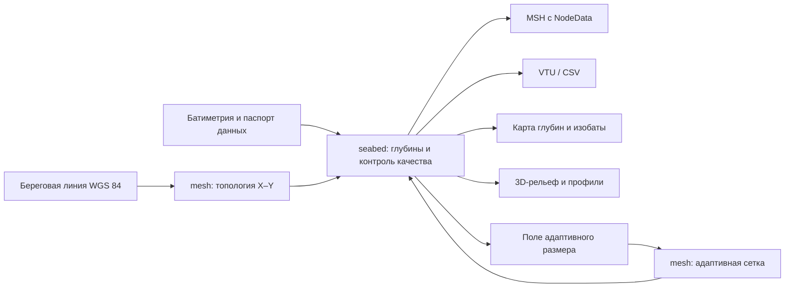

# План построения береговой линии и рельефа морского дна

## 1. Цель следующего этапа

Преобразовать существующую плоскую 2D-сетку Чёрного моря в проверяемую
батиметрическую модель, которая одновременно:

- следует наблюдаемой береговой линии;
- содержит глубину в каждом узле и расчётной ячейке;
- изменяет размер ячеек от 200–300 м у сложного берега и крутых склонов до
  500–1000 м на ровных глубоководных участках;
- экспортируется в форматы, пригодные для визуализации и последующих численных
  расчётов;
- имеет воспроизводимые метрики качества береговой линии, глубины и сетки;
- создаёт понятные обзорные карты, увеличенные фрагменты сетки и 3D-модель дна.

Результатом этапа должна быть не просто плотная «паутина» рёбер, а связанный
набор: карта глубин, изобаты, сетка в увеличенном масштабе, профили дна,
3D-поверхность и отчёт о погрешностях.

## 2. Текущее состояние и границы работ

Сейчас `lito mesh` создаёт корректную горизонтальную топологию в плоскости
`X–Y`, но все узлы имеют `Z = 0`. Батиметрия уже представлена типом
`geometry.BathymetryGrid` и поддерживает билинейную интерполяцию, однако не
связана с узлами Gmsh. Обзорный SVG прореживает крупные сетки, поэтому на карте
всего моря отдельные километровые ячейки выглядят как зернистый узор.

В рамках следующего этапа не реализуются уравнения мелкой воды, течения,
волнение или перенос наносов по 2D-сетке. Сначала должна появиться
верифицированная геометрия дна; физические модели подключаются к ней отдельным
этапом после проверки данных и форматов.

## 3. Целевая архитектура



Архитектурные правила:

1. `lito mesh` отвечает за береговую границу, топологию и качество ячеек.
2. Новый этап `lito seabed` связывает готовую сетку с батиметрией.
3. Отметка дна `elevation_m` хранится как координата `Z`, а положительная вниз
   глубина `water_depth_m` — отдельным скалярным полем, чтобы знак не зависел
   от соглашений конкретного решателя.
4. Исходная батиметрия никогда не перезаписывается; производные файлы и отчёты
   сохраняются в `output/seabed/`.
5. Обзор рельефа и просмотр ячеек разделяются: на общей карте используются
   цвета и изобаты, а полная геометрия ячеек показывается в увеличенных вставках.

## 4. Целевой интерфейс команд

Контракт данных зафиксирован в задаче `ARCH-01`; интерфейс команд будет
реализован и уточнён в задачах этапа F:

```bash
# Назначить глубины уже построенной сетке
./lito seabed build \
  --mesh output/mesh/msh/black-sea-edge-1000-detail-1000-frontal-quad.msh \
  --bathymetry /путь/к/black-sea-bathymetry.json \
  --bathymetry-metadata /путь/к/black-sea-bathymetry.metadata.json

# Проверить глубины, объём, уклоны и покрытие
./lito seabed validate --input output/seabed/black-sea-depth.msh

# Повторно создать карты без пересчёта глубин
./lito seabed render --input output/seabed/black-sea-depth.msh

# Построить адаптивную сетку по берегу и градиенту глубины
./lito mesh \
  --adaptive \
  --bathymetry /путь/к/black-sea-bathymetry.json \
  --coast-edge 250 \
  --shelf-edge 500 \
  --basin-edge 1000
```

## 5. Backlog задач

### Этап A. Контракт и проверенный источник данных

#### ARCH-01 — Зафиксировать контракт батиметрической модели

- Статус: **выполнено 2026-08-20**.
- Приоритет: P0.
- Зависимости: нет.
- Размер: S.
- Работы:
  - [x] выбрать соглашение о знаке отметки/глубины и вертикальном датуме;
  - [x] определить обязательные поля узла, ячейки и флага качества;
  - [x] решить, какие данные записываются в MSH, VTU, CSV и JSON;
  - [x] описать разделение команд `mesh` и `seabed`;
  - [x] проверить политику хранения неподтверждённого legacy-набора.
- Артефакты:
  - [`docs/adr/seabed-data-contract.md`](../docs/adr/seabed-data-contract.md);
  - [схема JSON-отчёта `lito-seabed/v1`](../docs/schemas/lito-seabed-v1.schema.json);
  - [синтетический пример одной ячейки](../docs/examples/lito-seabed-v1.example.json).
- Готово, когда:
  - [x] единицы, знак, системы координат и NoData однозначно описаны;
  - [x] один синтетический пример представлен без неявных допущений.

#### DATA-01 — Выбрать и зафиксировать источник батиметрии Чёрного моря

- Статус: **выполнено 2026-08-20**.
- Приоритет: P0.
- Зависимости: `ARCH-01`.
- Размер: M.
- Работы:
  - [x] сравнить доступные открытые наборы по разрешению, покрытию, лицензии,
    вертикальному датуму и дате версии;
  - [x] выбрать основной источник и контрольный набор с явной оговоркой об их
    частичной взаимозависимости;
  - [x] исключить `data/legacy/*-unverified*` из научных расчётов;
  - [x] зафиксировать корректную библиографическую ссылку;
  - [x] удалить поддержку других акваторий из CLI и проверять координаты входов.
- Артефакты:
  - [`docs/bathymetry-source-selection.md`](../docs/bathymetry-source-selection.md);
  - [`data/black-sea-bathymetry-source.json`](../data/black-sea-bathymetry-source.json);
  - [`data/black-sea-bathymetry-source.metadata.json`](../data/black-sea-bathymetry-source.metadata.json);
  - SHA-256 высотного NetCDF:
    `c957981ff054f50d1cd87f730c1e6b08f948686f8342a8208655a512efaa77ac`;
  - SHA-256 TID NetCDF:
    `32e1a21859c0422553f7b3bb7f7fbb9c35c65f170e3cc0f5c32fbd572e239f9e`.
- Готово, когда:
  - [x] источник можно повторно загрузить по документированной процедуре;
  - [x] лицензия допускает использование и публикацию производных результатов;
  - [x] покрытие включает всю акваторию, а NoData описан численно.

#### DATA-02 — Реализовать воспроизводимую загрузку и кэширование

- Приоритет: P0.
- Зависимости: `DATA-01`.
- Размер: M.
- Работы:
  - [x] добавить загрузчик исходного формата без ручной правки данных;
  - [x] сохранять исходник, паспорт, контрольную сумму и журнал преобразования;
  - [x] экспортировать внутренний формат `lat, lon, elevation_m,
    water_depth_m, quality`;
  - [x] проверять диапазоны координат, глубины, дубликаты и пропуски.
- Артефакты:
  - [x] файлы в `output/source/`;
  - [x] отчёт `bathymetry-source-report.json`.
- Готово, когда:
  - [x] повторный запуск даёт тот же SHA-256 и число точек;
  - [x] повреждённый, неполный или неподтверждённый набор отклоняется с русским
    диагностическим сообщением.

### Этап B. Привязка глубины к сетке

#### GEO-01 — Добавить обратное преобразование LAEA → WGS 84

- Статус: **выполнено 2026-08-21**.
- Приоритет: P0.
- Зависимости: `ARCH-01`.
- Размер: M.
- Работы:
  - [x] реализовать обратную сферическую LAEA-проекцию;
  - [x] сохранять `lat/lon` каждого узла вместе с `X/Y`;
  - [x] добавить тесты прямого и обратного преобразования на границах Чёрного моря.
- Артефакты:
  - [`internal/domain/mesh/projection.go`](../internal/domain/mesh/projection.go);
  - [`docs/mesh-generation.md`](../docs/mesh-generation.md#равноплощадная-проекция);
  - блоки `$NodeData` `longitude_deg` и `latitude_deg` в итоговых MSH 2.2.
- Готово, когда:
  - [x] ошибка цикла `WGS 84 → LAEA → WGS 84` документирована и существенно меньше
    размера минимальной ячейки;
  - [x] тесты включают западную, восточную, северную и южную границы акватории.

#### BATHY-01 — Интерполировать глубину в узлы сетки

- Приоритет: P0.
- Зависимости: `DATA-02`, `GEO-01`.
- Размер: L.
- Работы:
  - переиспользовать `BathymetryGrid` для регулярных наборов;
  - добавить стратегию для нерегулярных точек, если её требует источник;
  - сохранять способ интерполяции, расстояние до исходного измерения и флаг
    качества каждого узла;
  - запретить неявное заполнение NoData нулевой глубиной.
- Артефакты:
  - `node-depth.csv`;
  - блок статистики покрытия в `seabed-quality.json`.
- Готово, когда:
  - 100% принятых узлов имеют конечную глубину и флаг происхождения;
  - синтетическая плоскость и аналитическая чаша восстанавливаются с ожидаемой
    погрешностью;
  - число ближайших замен и максимальное расстояние до измерения отражены в
    отчёте.

#### BATHY-02 — Согласовать батиметрию с береговой линией

- Приоритет: P0.
- Зависимости: `BATHY-01`.
- Размер: L.
- Работы:
  - определить береговые узлы и обеспечить для них уровень моря `Z = 0`;
  - устранить положительные отметки `elevation_m` внутри акватории и
    отрицательные отметки на суше;
  - обработать расхождение береговых масок без создания ступеней и ям;
  - маркировать острова и открытые границы отдельно.
- Готово, когда:
  - береговая граница непрерывна и имеет согласованный нулевой уровень;
  - нет искусственных провалов около берега;
  - все исправления подсчитаны и перечислены в отчёте.

#### BATHY-03 — Рассчитать глубину и производные характеристики ячеек

- Приоритет: P1.
- Зависимости: `BATHY-02`.
- Размер: M.
- Работы:
  - вычислить среднюю, минимальную и максимальную глубину ячейки;
  - рассчитать уклон, экспозицию и локальную шероховатость;
  - выделить шельф, материковый склон и глубоководную область настраиваемыми
    порогами.
- Готово, когда:
  - характеристики воспроизводятся из узловых значений;
  - единицы и методы расчёта записаны в метаданных.

### Этап C. Экспорт модели дна

#### EXPORT-01 — Расширить MSH батиметрическими данными

- Приоритет: P0.
- Зависимости: `BATHY-02`.
- Размер: M.
- Работы:
  - записывать `Z = elevation_m` для визуализации поверхности;
  - сохранять `elevation_m`, `water_depth_m` и флаг качества отдельными
    блоками `$NodeData`;
  - добавить `$ElementData` со средней глубиной и уклоном ячейки;
  - сохранить совместимость чтения плоских MSH.
- Артефакт: `output/seabed/black-sea-depth.msh`.
- Готово, когда:
  - обратное чтение сохраняет число узлов, ячеек и значения глубины;
  - плоская и батиметрическая сетки различаются явно по схеме метаданных.

#### EXPORT-02 — Добавить VTU и табличный экспорт

- Приоритет: P1.
- Зависимости: `BATHY-03`.
- Размер: M.
- Работы:
  - экспортировать `.vtu` для ParaView;
  - сохранять `nodes.csv`, `cells.csv`, `profiles.csv`;
  - включать проекцию, вертикальный датум и единицы в каждый формат.
- Готово, когда:
  - VTU открывается без предупреждений и содержит поля глубины/качества;
  - табличные файлы согласованы с MSH по идентификаторам.

### Этап D. Понятная визуализация

#### VIEW-01 — Создать обзорную батиметрическую карту

- Приоритет: P0.
- Зависимости: `BATHY-03`.
- Размер: L.
- Работы:
  - заменить плотную паутину на непрерывную цветовую шкалу глубин;
  - построить подписанные изобаты;
  - добавить легенду, масштаб, источник, вертикальный датум и долю NoData;
  - не рисовать рёбра, если они меньше одного экранного пикселя.
- Артефакт: `output/seabed/svg/bathymetry-overview.svg`.
- Готово, когда:
  - по карте различимы шельф, склон и глубоководная котловина;
  - цвета имеют числовую легенду и не интерпретируются без единиц.

#### VIEW-02 — Добавить увеличенные фрагменты фактической сетки

- Приоритет: P0.
- Зависимости: `VIEW-01`.
- Размер: M.
- Работы:
  - выбрать минимум три контрольных района: сложный залив/коса, шельф и крутой
    склон;
  - показать непрореженные ячейки, берег и локальные изобаты;
  - подписать среднюю, минимальную и максимальную длину ребра;
  - добавить карту качества ячеек цветом.
- Артефакт: `output/seabed/svg/mesh-details.svg`.
- Готово, когда:
  - форма четырёхугольников визуально различима;
  - пользователь может сопоставить изменение размера сетки с берегом и
    градиентом глубины.

#### VIEW-03 — Построить 3D-рельеф и профили

- Приоритет: P1.
- Зависимости: `EXPORT-02`.
- Размер: L.
- Работы:
  - сформировать 3D-вид с явно указанным вертикальным преувеличением;
  - построить несколько поперечных профилей «берег → глубоководная часть»;
  - показывать исходные батиметрические точки и интерполированную поверхность в
    режиме контроля.
- Артефакты:
  - `seabed-3d.svg` или статический PNG;
  - `profiles.svg` и `profiles.csv`.
- Готово, когда:
  - без вертикального преувеличения данные остаются метрически корректными;
  - при его применении коэффициент всегда подписан на рисунке.

### Этап E. Адаптивная четырёхугольная сетка

#### ADAPT-01 — Построить поле требуемого размера ячейки

- Приоритет: P1.
- Зависимости: `BATHY-03`, `VIEW-02`.
- Размер: L.
- Работы:
  - учитывать расстояние до берега, кривизну берега и градиент глубины;
  - задать базовые диапазоны: 200–300 м у берега, 500 м на шельфе,
    1000 м на ровных глубоководных участках;
  - ограничить скорость роста соседних рёбер;
  - сохранять поле размера отдельным отчётом и картой.
- Готово, когда:
  - размер ячейки объясняется входными признаками, а не случайностью генератора;
  - нет резких скачков масштаба между соседними ячейками.

#### ADAPT-02 — Передать поле размера в Gmsh

- Приоритет: P1.
- Зависимости: `ADAPT-01`.
- Размер: L.
- Работы:
  - создать воспроизводимый Gmsh Background Field;
  - сохранить full-quad преобразование и граничные метки;
  - контролировать число ячеек до запуска;
  - добавить потоковую обработку для многомиллионных сеток.
- Готово, когда:
  - целевые диапазоны подтверждены статистикой рёбер по зонам;
  - полный MSH не содержит треугольников и висячих узлов;
  - память и время отражены в отчёте.

#### ADAPT-03 — Сравнить генераторы на адаптивной сетке

- Приоритет: P1.
- Зависимости: `ADAPT-02`, `QA-02`.
- Размер: M.
- Работы:
  - повторить Delaunay, Frontal-Delaunay for Quads и Packing of Parallelograms;
  - учитывать не только береговую площадь, но и сохранение батиметрии;
  - фиксировать тайм-ауты, память и неуспешные алгоритмы;
  - выбрать лучший алгоритм отдельно для каждого контрольного масштаба.
- Готово, когда:
  - рейтинг можно воспроизвести из JSON без визуальной субъективности;
  - одинаковая входная граница даёт одинаковую береговую ошибку, а различия
    объясняются качеством ячеек, глубины и вычислительной устойчивостью.

### Этап F. Научная проверка качества

#### QA-01 — Ввести тесты батиметрической интерполяции

- Приоритет: P0.
- Зависимости: `BATHY-01`.
- Размер: M.
- Работы:
  - тестировать плоскость, чашу, ступень и участок с NoData;
  - проверять береговое условие `Z = 0`;
  - добавить property-тесты диапазона и конечности глубин.
- Готово, когда:
  - тесты обнаруживают смену знака, выход за диапазон и скрытое заполнение NoData.

#### QA-02 — Добавить метрики сохранения рельефа

- Приоритет: P0.
- Зависимости: `BATHY-03`.
- Размер: L.
- Метрики:
  - MAE, RMSE, смещение и P95 ошибки на отложенной выборке;
  - отклонение объёма водной толщи;
  - отклонение площадей между выбранными изобатами;
  - расстояние между исходными и восстановленными изобатами;
  - ошибка уклона и доля узлов с ближайшей заменой;
  - качество ячеек и соответствие целевому размеру по зонам.
- Готово, когда:
  - пороги качества обоснованы разрешением выбранного источника;
  - отчёт содержит как средние ошибки, так и худшие локальные участки.

#### QA-03 — Проверить полный контур Чёрного моря

- Приоритет: P0.
- Зависимости: `EXPORT-01`, `VIEW-01`, `QA-02`.
- Размер: L.
- Работы:
  - выполнить контрольный прогон 1000 м по всей акватории;
  - проверить отсутствие дыр, самопересечений и положительных глубин;
  - сверить площадь моря и интегральный объём с опубликованными ориентирами;
  - сохранить журнал ресурсов и версию данных.
- Готово, когда:
  - все проверки воспроизводимы одной командой;
  - отклонения объяснены в отчёте, а не скрыты усреднением.

### Этап G. CLI, документация и воспроизводимость

#### CLI-01 — Добавить команду `lito seabed`

- Приоритет: P0.
- Зависимости: `ARCH-01`, `BATHY-02`, `EXPORT-01`.
- Размер: L.
- Работы:
  - реализовать подкоманды `build`, `validate`, `render`;
  - добавить русскоязычную справку и защитные лимиты ресурсов;
  - все результаты сохранять в `output/seabed/`;
  - поддержать тихий режим и детальные журналы.
- Готово, когда:
  - полный путь «MSH + батиметрия → отчёты» выполняется одной документированной
    последовательностью команд.

#### DOC-01 — Обновить научную и пользовательскую документацию

- Приоритет: P0.
- Зависимости: все задачи соответствующего релиза.
- Размер: M.
- Работы:
  - обновить `README.md` и пакетную документацию;
  - описать источник, вертикальный датум, интерполяцию и ограничения;
  - добавить примеры карт и расшифровку каждого слоя;
  - явно отделить геометрию дна от 2D-гидродинамической модели.
- Готово, когда:
  - по документации можно воспроизвести результат с чистого рабочего каталога.

### Этап H. Опциональная оценка с ИИ

#### AI-01 — Подготовить экспертный набор контрольных фрагментов

- Приоритет: P2.
- Зависимости: `VIEW-02`, `QA-02`.
- Размер: M.
- Работы:
  - сохранить одинаковые фрагменты для всех генераторов;
  - получить экспертные оценки сохранения кос, заливов, островов и изобат;
  - отделить обучающую и контрольную выборки по географическим районам.

#### AI-02 — Проверить необходимость ML-модели

- Приоритет: P2.
- Зависимости: `AI-01`.
- Размер: M/L.
- Работы:
  - измерить корреляцию экспертных оценок с детерминированными метриками;
  - использовать ML только при доказанном дополнительном качестве;
  - сохранять версию модели, признаки и ошибку на независимой выборке.
- Ограничение:
  - нейросетевая оценка не заменяет геометрические и батиметрические метрики и
    не блокирует основной научный конвейер.

## 6. Порядок реализации по вехам

| Веха | Задачи | Проверяемый результат |
|---|---|---|
| M1. Данные | `ARCH-01`, `DATA-01`, `DATA-02` | Проверенный источник и паспорт батиметрии |
| M2. Глубины | `GEO-01`, `BATHY-01`, `BATHY-02`, `QA-01` | Глубина назначена всем узлам контрольной сетки |
| M3. Модель дна | `BATHY-03`, `EXPORT-01`, `EXPORT-02`, `QA-02` | MSH/VTU с глубиной и количественный отчёт |
| M4. Визуализация | `VIEW-01`, `VIEW-02`, `VIEW-03` | Понятная карта, детали сетки, 3D и профили |
| M5. Адаптация | `ADAPT-01`, `ADAPT-02`, `ADAPT-03` | Сетка 200–1000 м по берегу и рельефу |
| M6. Полный прогон | `QA-03`, `CLI-01`, `DOC-01` | Воспроизводимый результат всего Чёрного моря |
| M7. ИИ, при необходимости | `AI-01`, `AI-02` | Проверенная добавочная ценность ML-оценки |

Критический путь: `ARCH-01 → DATA-01 → DATA-02 → GEO-01 → BATHY-01 →
BATHY-02 → BATHY-03 → QA-02 → EXPORT-01 → VIEW-01 → QA-03`.

## 7. Риски и меры снижения

| Риск | Последствие | Мера |
|---|---|---|
| Несовпадение береговой маски и батиметрии | Ступени, ямы и глубины на суше | Явная береговая коррекция и отчёт исправлений |
| Неизвестный вертикальный датум | Систематическое смещение глубины | Обязательный паспорт и запрет немаркированных данных |
| NoData около берега | Искусственные нули или провалы | Флаги качества, ограниченный поиск ближайшего измерения |
| 200-метровая сетка слишком велика | Нехватка памяти и диска | Адаптивный размер, предварительная оценка, потоковый экспорт |
| Сильное сглаживание | Потеря каньонов и склонов | Контроль изобат, уклонов и объёма до/после обработки |
| Красивый, но неверный 3D-вид | Ошибочная интерпретация | Подписанное вертикальное преувеличение и числовые профили |
| ML без экспертного эталона | Невоспроизводимый рейтинг | ИИ только после разметки и сравнения с базовыми метриками |

## 8. Определение готовности всего этапа

Этап считается завершённым, когда:

1. Весь результат строится из документированного источника одной
   воспроизводимой последовательностью команд.
2. Каждый узел имеет `X`, `Y`, `lat`, `lon`, `elevation_m`,
   `water_depth_m` и флаг качества.
3. Береговые узлы согласованы с уровнем моря, отсутствуют необъяснённые NoData и
   глубины на суше.
4. MSH и VTU содержат полную четырёхугольную сетку и поля глубины.
5. Для всего Чёрного моря сформированы карта глубин, изобаты, увеличенные
   фрагменты сетки, профили и 3D-представление.
6. JSON-отчёт содержит ошибки интерполяции, объёма, изобат, уклонов, качества
   ячеек и использования ресурсов.
7. Адаптивная сетка статистически подтверждает диапазоны 200–300, 500 и
   1000 м в соответствующих зонах.
8. `go test ./...`, `go vet ./...`, проверка SVG и повторное чтение MSH/VTU
   проходят без ошибок.

## 9. Первая рекомендуемая итерация

Первую реализацию следует ограничить задачами `ARCH-01`, `DATA-01`, `DATA-02`,
`GEO-01`, `BATHY-01`, `BATHY-02`, `BATHY-03`, `QA-01` и `VIEW-01`. Она должна
работать на сетке 1000 м и дать первый понятный результат: цветную карту глубин
с изобатами и количественный отчёт покрытия. Только после её проверки следует
переходить к 200–500 м, 3D-экспорту и адаптивной сетке.
